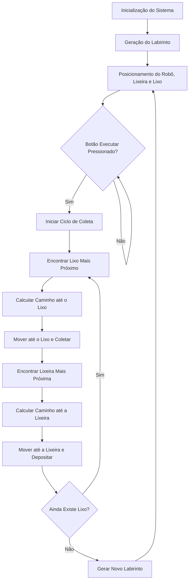

# 🤖 Catador de Lixo - Labirinto Interativo


<p align="center">
  
</p>

## 📋 Índice

- [Sobre o Projeto](#-sobre-o-projeto)
- [Topograma e Funcionamento](#-topograma-e-funcionamento)
- [Algoritmo de Caminho](#-algoritmo-de-caminho)
- [Tecnologias Utilizadas](#-tecnologias-utilizadas)
- [Como Executar](#-como-executar)
- [Estrutura do Projeto](#-estrutura-do-projeto)
- [Contribuições](#-contribuições)
- [Licença](#-licença)

## 🔍 Sobre o Projeto

Este simulador representa um robô catador de lixo que navega por um labirinto gerado aleatoriamente. O robô utiliza um algoritmo de pathfinding (A*) para encontrar o caminho mais eficiente até os itens de lixo e depois até a lixeira para depositá-los. O projeto demonstra conceitos de geração de labirintos, algoritmos de busca de caminhos e animações em JavaScript.

## 🗺️ Topograma e Funcionamento

O sistema do robô catador de lixo funciona seguindo o fluxograma abaixo:



### Componentes do Sistema

<p align="center">
  
</p>

1. **Robô**: Representado pelo emoji 🤖 (carrega o emoji 🚮 quando está com lixo)
2. **Lixo**: Itens para coleta representados pelo emoji 🚮 (sempre 3 itens)
3. **Lixeira**: Destino para depósito do lixo representado pelo emoji 🗑️ (sempre 1 lixeira)
4. **Labirinto**: Gerado aleatoriamente com paredes e caminhos
5. **Controles**: Botão para executar o ciclo de coleta do robô

## 🧮 Algoritmos Implementados

O projeto implementa dois algoritmos principais:

### 1. Geração do Labirinto (DFS)

```
1. Iniciar com um grid preenchido com paredes
2. Escolher uma célula inicial e marcá-la como passagem
3. Usar o algoritmo de Busca em Profundidade (DFS):
   a. Para cada direção possível (cima, direita, baixo, esquerda):
      i. Verificar se a célula a duas unidades de distância está dentro dos limites e é uma parede
      ii. Se sim, transformar tanto essa célula quanto a célula entre elas em passagens
      iii. Continuar o DFS a partir da nova célula
4. Garantir conectividade mínima adicionando passagens extras se necessário
5. Posicionar o robô, a lixeira e os 3 itens de lixo em células vazias aleatórias
```

### 2. Algoritmo de Pathfinding (A*)

```
1. Inicializar conjuntos aberto e fechado
2. Adicionar posição inicial ao conjunto aberto
3. Enquanto o conjunto aberto não estiver vazio:
   a. Selecionar o nó com menor custo estimado (f = g + h)
   b. Se for o destino, reconstruir e retornar o caminho
   c. Remover o nó do conjunto aberto e adicionar ao fechado
   d. Para cada vizinho acessível:
      i. Calcular o custo g (distância do início)
      ii. Calcular a heurística h (distância Manhattan até o destino)
      iii. Atualizar o caminho se for melhor que o anterior
4. Se o conjunto aberto esvaziar sem encontrar o destino, não há caminho possível
```

### 3. Ciclo de Coleta de Lixo

```
1. Enquanto houver lixo para coletar:
   a. Encontrar o lixo mais próximo do robô
   b. Calcular e seguir o caminho até o lixo
   c. Coletar o lixo (remover do labirinto e marcar o robô como carregando)
   d. Encontrar a lixeira mais próxima
   e. Calcular e seguir o caminho até a lixeira
   f. Depositar o lixo na lixeira
2. Quando todo o lixo for coletado, gerar um novo labirinto
```

## 💻 Tecnologias Utilizadas

- **HTML5**: Estrutura da página e elementos visuais
- **CSS3**: Estilização e layout responsivo
- **JavaScript**: Lógica de funcionamento, algoritmos de pathfinding e geração de labirintos
- **CSS Grid**: Renderização do labirinto
- **Emojis**: Representação visual dos elementos do jogo

## 🚀 Como Executar

1. Clone este repositório:
   ```bash
   git clone https://github.com/Italo-Schezar/CtadorDeLixo.git
   ```

2. Abra o arquivo `index.html` em seu navegador

3. Clique no botão "Executar Caminho do Robô" para iniciar a simulação

4. Um novo labirinto será gerado automaticamente após a conclusão do ciclo

## 📁 Estrutura do Projeto

```
CtadorDeLixo/
├── index.html           # Estrutura da página e elementos visuais
├── css/
│   └── style.css       # Estilização dos componentes
├── js/
│   ├── maze.js         # Geração e gerenciamento do labirinto
│   ├── pathfinding.js  # Algoritmo A* para encontrar caminhos
│   ├── renderer.js     # Renderização visual do labirinto
│   └── main.js         # Inicialização e controle da aplicação
└── README.md           # Documentação do projeto
```

## 🤝 Contribuições

Contribuições são bem-vindas! Sinta-se à vontade para abrir issues ou enviar pull requests com melhorias.

1. Faça um fork do projeto
2. Crie uma branch para sua feature (`git checkout -b feature/nova-feature`)
3. Commit suas mudanças (`git commit -m 'Adiciona nova feature'`)
4. Push para a branch (`git push origin feature/nova-feature`)
5. Abra um Pull Request

## 📄 Licença

Este projeto está licenciado sob a Licença MIT - veja o arquivo LICENSE para detalhes.

---

<p align="center">
  Desenvolvido por Italo Schezar, Felipe Avelar e Pedro Anibal
</p>
