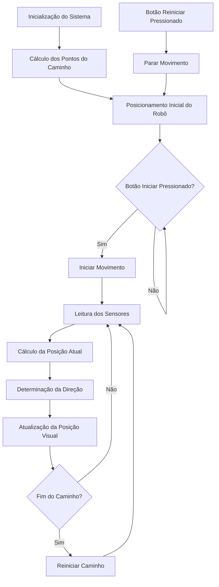

# 🤖 Robô Seguidor de Linha - Simulador


## 📋 Índice

- [Sobre o Projeto](#-sobre-o-projeto)
- [Topograma e Funcionamento](#-topograma-e-funcionamento)
- [Algoritmo de Caminho](#-algoritmo-de-caminho)
- [Tecnologias Utilizadas](#-tecnologias-utilizadas)
- [Como Executar](#-como-executar)
- [Estrutura do Projeto](#-estrutura-do-projeto)
- [Contribuições](#-contribuições)
- [Licença](#-licença)

## 🔍 Sobre o Projeto

Este simulador representa um robô seguidor de linha, demonstrando como os algoritmos de detecção e navegação funcionam em um ambiente controlado. O robô utiliza sensores para detectar a linha branca e ajustar sua trajetória para seguir o caminho definido.

## 🗺️ Topograma e Funcionamento

O sistema do robô seguidor de linha funciona seguindo o fluxograma abaixo:



### Componentes do Sistema

<p align="center">
  
</p>

1. **Robô**: Representado visualmente com corpo, esteiras e sensores
2. **Sensores**: Quatro sensores que detectam a proximidade com a linha
3. **Pista**: Caminho definido por uma linha branca em fundo escuro
4. **Controles**: Botões para iniciar e reiniciar a simulação

## 🧮 Algoritmo de Caminho

O algoritmo implementado para seguir o caminho funciona da seguinte forma:

### 1. Pré-processamento do Caminho

```
1. Obter o caminho SVG definido no HTML
2. Calcular o comprimento total do caminho
3. Dividir o caminho em N pontos equidistantes
4. Armazenar as coordenadas (x,y) de cada ponto
```

### 2. Navegação do Robô

```
1. Iniciar no primeiro ponto do caminho
2. Para cada frame de animação:
   a. Avançar para o próximo ponto no caminho
   b. Calcular a posição interpolada entre pontos para movimento suave
   c. Calcular a rotação com base na direção do caminho
   d. Verificar os sensores em relação à linha
   e. Atualizar a posição visual do robô
3. Se chegar ao final do caminho, reiniciar do início
```

### 3. Detecção de Linha

O robô utiliza quatro sensores para detectar a linha:

<p align="center">
  
</p>

```
Para cada sensor:
1. Calcular a posição do sensor com base na posição e rotação do robô
2. Calcular a distância do sensor à linha
3. Se a distância for menor que um limiar (30px):
   - Ativar o sensor (mudar cor para verde)
   - Ajustar a direção do robô
4. Caso contrário:
   - Desativar o sensor (manter cor vermelha)
```

## 💻 Tecnologias Utilizadas

- **HTML5**: Estrutura da página e elementos visuais
- **CSS3**: Estilização e animações
- **JavaScript**: Lógica de funcionamento e algoritmos
- **SVG**: Definição do caminho a ser seguido

## 🚀 Como Executar

1. Clone este repositório:
   ```bash
   git clone https://github.com/seu-usuario/robo-seguidor-linha.git
   ```

2. Abra o arquivo `index.html` em seu navegador

3. Use os botões "Iniciar" e "Reiniciar" para controlar a simulação

## 📁 Estrutura do Projeto

```
robo-seguidor-linha/
├── index.html      # Estrutura da página e elementos visuais
├── style.css       # Estilização dos componentes
├── script.js       # Lógica de funcionamento e algoritmos
└── README.md       # Documentação do projeto
```

## 🤝 Contribuições

Contribuições são bem-vindas! Sinta-se à vontade para abrir issues ou enviar pull requests com melhorias.

1. Faça um fork do projeto
2. Crie uma branch para sua feature (`git checkout -b feature/nova-feature`)
3. Commit suas mudanças (`git commit -m 'Adiciona nova feature'`)
4. Push para a branch (`git push origin feature/nova-feature`)
5. Abra um Pull Request

## 📄 Licença

Este projeto está licenciado sob a Licença MIT - veja o arquivo LICENSE para detalhes.

---

<p align="center">
  Desenvolvido poe por Italo Schezar, Felipe Avelar e Pedro Anibal
</p>
